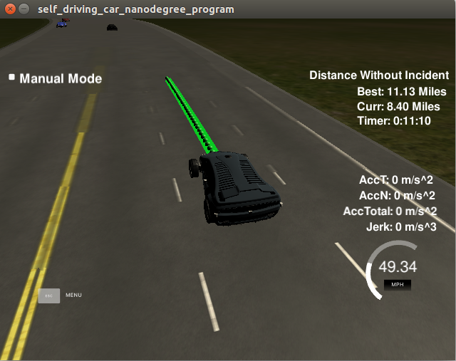

Description Of The Code
1. Behavior Planning
We used a finite state machine to decide what the state might be in the current time.In our state machine,there are five states availible.They are "KL"-Keep Lane,"LCL"-Lane Change Left,"LCR"-Lane Change Right,"PLCL"-Prepare Lane Change Left,"PLCR"-Prepare Lane Change Right.The state transformation was achieved in the function successor_states in the line 690 of main.cpp.The function received the state of the car and the lane the car stays in the last time as parameter,and output the possible state as a vector. 
2. Trajectory Generation
After get the possible state of the car,we calculate a trajectory for each possible state.It was achieved in the function generate_trajectory in the line 700 of the main.cpp.We passed the state,ego car information,sensor fusion data,map data,previous path to the function.And it outputs the trajectory and intended lane info and final lane info for each state.The intended lane info include the intended lane for the calculating state and the reference velocity in the intended lane.The final lane info include the final lane for the calculation state and reference velocity.These two information will be used to calculate the cost for each trajectory which we will explain in the next paragraph.In the function generation_trajectory,we divided into three situation as keep lane,lane change left or lane chane right,prepare lane change left or prepare lane change right.And we will discuss it below.But before that I have to introduce two functions here.They will be used in all the three situations.The first is the get_kinematics function.This function received the sensor fusion data,ego car data,lane and reference velocity.And it calculate the max velocity in the input lane.The Second is the getTrajectory function.This function use the final lane and the reference velocity to generate the path point. 
1)Keep lane 
In this situation,the intended lane and the final lane are the same.They are both the current lane.So I first calculate the final lane max velocity and then generate the path point.
2)Lane change
In this situation the final lane and the intended lane are both the lane to change.But before calculating the velocity and path point,I check the safty first.If there is another car in the lane which the ego car is about to change and the car is close to the ego car,then this lane change is unsafe,then we return an empty path point vector.If this lane change is safe,we calculate the max velocity and generate path point as in the keep lane situation.
3)Prepare lane change
In this situation,the final lane is the current lane,and the intended lane is the lane the car want to change.We will calculate the max velocity in both of the two lane.And the reference velocity will equal to the smaller one.Then We use the reference velocity and the final lane generating the path point.
3. Calculate the cost
There are two factors in the cost function.They are the velocity cost and inlane cost.The velocity cost weighted 30% and the inlane cost weighted 70%.If the final lane velocity and the intended velocity both close to the max reference velocity,the cost is small.If the intended lane and the final lane both in the availible lane,the cost is zero.
4. Result

